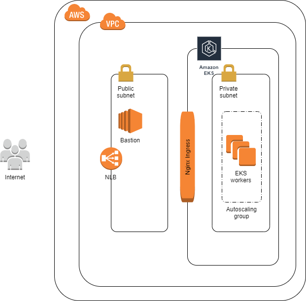

# About
This demo project implements the following:

- Kubernetes cluster containing 1 master and 1 or more nodes
- nginx-ingress with modsecurity firewall deployed to Kubernetes cluster
- OWASP "juice shop" application deployed to Kubernetes cluster
- WAF filtering rules protecting "juice shop" application from SQL injection

## Tools

This implementation uses the following tech:

- Terraform for infrastructure as code.
- AWS VPC for base networking. 
- AWS EKS service for Kubernetes.

## Pre-requisites

The implementation is built and tested on Linux.

The following need to be installed locally and present on PATH:

- [Terraform](https://www.terraform.io/downloads.html)
- [AWS CLI](https://docs.aws.amazon.com/cli/latest/userguide/cli-chap-install.html)
- [AWS IAM Authenticator](https://docs.aws.amazon.com/eks/latest/userguide/install-aws-iam-authenticator.html)
- [Kubectl](https://kubernetes.io/docs/tasks/tools/install-kubectl/#install-kubectl)

### AWS authentication

IAM credentials can be provided via the envrionment variables AWS_ACCESS_KEY_ID and AWS_SECRET_ACCESS_KEY, representing AWS Access Key and AWS Secret Key, respectively.

```
$ export AWS_ACCESS_KEY_ID="Your Access Key"
$ export AWS_SECRET_ACCESS_KEY="Your Secret Key"
$ export TF_VAR_aws_access_key=$AWS_ACCESS_KEY_ID
$ export TF_VAR_aws_secret_key=$AWS_SECRET_ACCESS_KEY
```

### Terraform

This implementation supports Terraform version 0.12. It utilizes modules to manage complex resources like VPC and EKS cluster. This implementation does not use a remote backend for Terraform state and stores the state locally.

### Terraform variables

This implementation parameterizes required configurable settings through variables. Custom variables are defined in `variables.tf` and their values are controlled through `terraform.tfvars`.

## Architecture



### Kubernetes

This implementation uses AWS EKS managed service to run Kubernetes.

In order to comply with the task requirements (access to Kubernetes API is restricted to number of IP addresses), EKS API endpoint is eventually setup with private access. EKS API endpoint can be accessed through a bastion host in the same VPC, and access to bastion host is restricted to a number of IP addresses.

EKS cluster is exposed to the public internet using AWS Network Load Balancer provider which is created with ingress-nginx service.

To simplify the initial setup of EKS cluser and to allow running `kubectl` from the local workstation, we temporarily allow public access to EKS API endpoint during cluster creation by overriding a terraform variable. After the cluster setup is completed, we apply terraform configuration again.

### Bastion

Bastion host allows connectivity to Kubernetes API (EKS Control plane) from outside of VPC. Bastion is created in a public subnet with Elastic IP attached. Access to bastion is restricted to a number of IP addresses using security group. SSH key pair for bastion host is created with Terraform and written to SSM Parameter Store.

EKS cluster operation is performed from the bastion host. Bastion host is bootstrapped upon creation and the following is installed:

- [AWS CLI](https://docs.aws.amazon.com/cli/latest/userguide/cli-chap-install.html)
- [AWS IAM Authenticator](https://docs.aws.amazon.com/eks/latest/userguide/install-aws-iam-authenticator.html)
- [Kubectl](https://kubernetes.io/docs/tasks/tools/install-kubectl/#install-kubectl)

# Installation instructions

Make sure you have pre-requisites and AWS authentication setup as mentioned above. 

### Clone repository

Clone the solution repository and go into its directory:

```
git@github.com:0leksei/hometest.git
cd hometest
```

### Run Terraform

Set environment variables locally like this:

```
$ export AWS_ACCESS_KEY_ID="Your Access Key"
$ export AWS_SECRET_ACCESS_KEY="Your Secret Key"
$ export TF_VAR_aws_access_key=$AWS_ACCESS_KEY_ID
$ export TF_VAR_aws_secret_key=$AWS_SECRET_ACCESS_KEY
```

Tune variables values in `terraform.tfvars` as needed.

Execute Terraform to create AWS resources:

```
terraform init
terraform plan -var 'api_public_access=true'
terraform apply -var 'api_public_access=true' -auto-approve
```

### Install ingress-nginx controller and a service

Run `kubectl apply` to install ingress-nginx controller and a service for it:

```
kubectl --kubeconfig kubeconfig_* apply -f files/mandatory.yaml
kubectl --kubeconfig kubeconfig_* apply -f files/ingress-nginx.yaml
```

### Deploy OWASP juice shop

Run `kubectl` to deploy OWASP juice shop application, create a service for it and an ingress object:

```
kubectl --kubeconfig kubeconfig_* apply -f files/deployment.yaml
```

### Enable WAF filtering

Run `kubectl` to enable WAF filtering rules:

```
kubectl --kubeconfig kubeconfig_* apply -f files/waf.yaml
```

### Connect to the application

Run `kubectl get svc` and get DNS name of AWS NLB to connect to:

```
kubectl --kubeconfig kubeconfig_* get svc -n ingress-nginx
```

### Disable EKS API endpoint public access

Finally, disable EKS API endpoint public access by running `terraform apply` once again:

```
terraform apply -auto-approve
```

# Usage instructions

When EKS API endpoint public access is disabled after cluster setup and application deployment, we connect to EKS API through a bastion host, as recommended at https://docs.aws.amazon.com/eks/latest/userguide/cluster-endpoint.html

### Retrieve bastion's EC2 key from AWS SSM

```
aws ssm get-parameters --names /ssh_keys/aleksei-ec2-key --with-decryption --query Parameters[0].[Value] --output text > private_key.pem
chmod 400 private_key.pem
```

### Connect to bastion

Copy `kubeconfig` to the bastion for easier connectivity:

```
scp -i private_key.pem kubeconfig* ec2-user@$(aws ec2 describe-instances --filters Name=tag:Bastion,Values=true --query Reservations[*].Instances[*].PublicIpAddress --output text):~
```

Connect to the bastion with SSH:

```
ssh ec2-user@$(aws ec2 describe-instances --filters Name=tag:Bastion,Values=true --query Reservations[*].Instances[*].PublicIpAddress --output text) -i private_key.pem
```

Provide AWS Access key and Secret key with environment variables or as needed otherwise.

Connect to EKS API endpoint from the bastion:

```
kubectl --kubeconfig ~/kubeconfig* get pods -A
```

## Troubleshooting

Check the ingress controller pods to make sure if it is setup correctly:
```
kubectl get pods -n ingress-nginx
```

Check the created service if it is attached to the load balancer:
```
kubectl get svc -n ingress-nginx
```

Check the deployment status in `demo` namespace:
```
kubectl get deployments -n demo
```

Check the service status in `demo` namespace:
```
kubectl get svc -n demo
```

Describe created ingress object created to check the configurations in `demo` namespace:
```
kubectl describe ingress -n demo
```

Examine ingress-nginx logs:
```
kubectl logs -n kube-system nginx-ingress-controller-6766d5b6c7-9qvfm
```

Look at ModSecurity audit logs:
```
kubectl exec -it -n ingress-nginx nginx-ingress-controller-7dcc95dfbf-rlqcz cat /var/log/modsec_audit.log
```

# Links

Links to resources which were used in implementing the solution:

https://kubernetes.github.io/ingress-nginx/deploy/

https://devopscube.com/setup-ingress-kubernetes-nginx-controller/

https://medium.com/@awkwardferny/enabling-modsecurity-in-the-kubernetes-ingress-nginx-controller-111f9c877998

https://docs.aws.amazon.com/eks/latest/userguide/load-balancing.html

https://aws.amazon.com/blogs/opensource/network-load-balancer-nginx-ingress-controller-eks/

https://octoperf.com/blog/2019/09/05/kraken-kubernetes-ingress-nginx-frontend/
